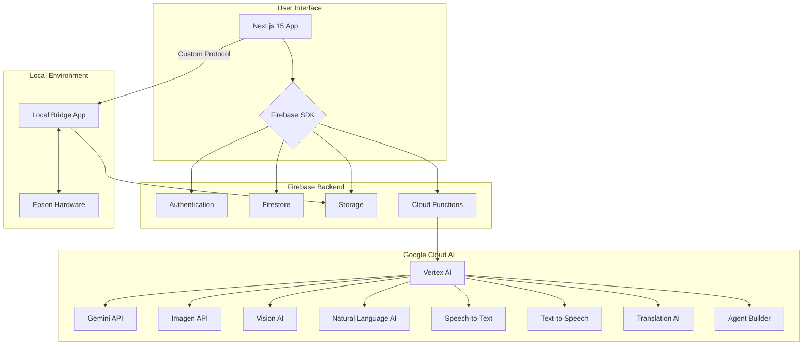

# AIOプレス 超詳細技術仕様書 (Firebase + Google Cloud Edition)

## 1. プロジェクト概要

### 1.1. アプリケーションの目的

本アプリケーション「AIOプレス」は、企業のブランド資産を一元管理し、Google Cloudの最先端AI技術（Vertex AI, Gemini, Imagen等）を駆使して、「人間」と「AI」の両方に最適化されたブランドコミュニケーションを自動生成する、フルスタックWebアプリケーションである。社内に散在する資産の活用、ブランド構築コストの削減、ブランド一貫性の担保、そしてAI時代における発見可能性の向上を実現することを目的とする。

### 1.2. 解決する課題

| 課題カテゴリ | 具体的な課題 | ビジネスインパクト |
| :--- | :--- | :--- |
| **資産のサイロ化** | 過去に作成された有益な資料（デザイン、コピー、戦略書等）が整理されず、ナレッジとして活用されていない。 | 毎回ゼロから制作するため、デザインコストと工数が膨らみ続ける。 |
| **ブランドの不統一** | 営業、広告、店舗など、部署ごとに異なるメッセージやデザインが乱立し、ブランドの一貫性が欠如している。 | 収益機会が最大23%失われる可能性がある。[1] |
| **AI時代の可視性** | AIによる情報収集やコンテンツ生成が主流となる中で、AIに発見・評価されないブランドは顧客の選択肢から除外される。 | AI・検索経由の商品発見率は70%以上に達しており、この潮流から取り残されるリスクがある。[2] |

## 2. アーキテクチャ

### 2.1. システム構成図

本システムは、Next.jsによるフロントエンド、Firebaseによるバックエンド基盤、そしてGoogle CloudのAIサービス群を連携させたモダンな構成を採用する。



### 2.2. 技術スタック

| レイヤー | 技術 | 目的・役割 |
| :--- | :--- | :--- |
| **フロントエンド** | Next.js 15 (App Router), TypeScript, React 19 | 高速かつインタラクティブなUIの構築 |
| | Tailwind CSS, shadcn/ui | モダンで一貫性のあるデザインシステムの実装 |
| | Zustand, React Hook Form, Zod | 状態管理、フォームハンドリング、バリデーション |
| **バックエンド** | Firebase (Authentication, Firestore, Storage) | 認証、データベース、ファイルストレージの提供 |
| | Cloud Functions for Firebase (Node.js 20) | サーバーレスなバックエンドロジック、AI連携の実行 |
| **AI/ML** | Google Cloud Vertex AI | AIモデルの統合的な管理・実行プラットフォーム |
| | Gemini API, Imagen, Gemma | テキスト・画像生成、マルチモーダル分析 |
| | Vision AI, Natural Language AI, etc. | 高度な画像認識、自然言語処理機能の提供 |
| **ハードウェア連携** | Electron, TypeScript | Epson製ハードウェアを制御するローカルブリッジアプリ |

## 3. プロジェクトセットアップ

### 3.1. 前提条件

- Node.js >= 20.x
- pnpm (推奨)
- Google Cloud SDK (`gcloud` CLI)
- Firebase CLI
- Google CloudプロジェクトおよびFirebaseプロジェクトが作成済みであること

### 3.2. 初期設定

1.  **リポジトリのクローン:**
    ```bash
    git clone https://github.com/aiosoken/aiopress.git
    cd aiopress
    ```

2.  **必要なライブラリのインストール:**
    ```bash
    pnpm install
    ```

3.  **Firebase CLIのセットアップ:**
    ```bash
    firebase login
    firebase projects:list
    firebase use <YOUR_FIREBASE_PROJECT_ID>
    ```

4.  **shadcn/uiの初期化:**
    ```bash
    pnpm dlx shadcn-ui@latest init
    ```

### 3.3. 環境変数 (`.env.local`)

```env
# Firebase (Client-side)
NEXT_PUBLIC_FIREBASE_API_KEY="..."
NEXT_PUBLIC_FIREBASE_AUTH_DOMAIN="..."
NEXT_PUBLIC_FIREBASE_PROJECT_ID="..."
NEXT_PUBLIC_FIREBASE_STORAGE_BUCKET="..."
NEXT_PUBLIC_FIREBASE_MESSAGING_SENDER_ID="..."
NEXT_PUBLIC_FIREBASE_APP_ID="..."

# Google Cloud (Server-side / Cloud Functions)
GOOGLE_CLOUD_PROJECT_ID="..."
GOOGLE_APPLICATION_CREDENTIALS="./path/to/service-account.json"
```

## 4. ディレクトリ構造

```
src
├── app/                      # Next.js App Router
│   ├── (auth)/               # 認証関連ページ (サインイン、サインアップ)
│   │   └── sign-in/page.tsx
│   ├── (main)/               # メインアプリケーション (要認証)
│   │   ├── layout.tsx
│   │   ├── dashboard/        # ダッシュボード
│   │   └── brands/
│   │       └── [brandId]/      # 各ブランドのワークスペース
│   │           ├── assets/       # 資産管理
│   │           ├── design-system/ # デザインシステム
│   │           └── creatives/    # クリエイティブ生成
│   └── api/                  # API Routes (Next.js Backend)
│       └── ...
├── components/               # Reactコンポーネント
│   ├── ui/                   # shadcn/ui コンポーネント
│   └── features/             # 機能別コンポーネント (例: AssetUploader)
├── lib/                      # ライブラリ、ヘルパー関数
│   ├── firebase/             # Firebase関連 (client, admin, auth, firestore, storage)
│   ├── gcp/                  # Google Cloud AI関連 (vertexai, vision, language)
│   ├── hooks/                # カスタムReactフック
│   └── utils.ts              # 汎用ヘルパー
├── functions/                # Cloud Functions for Firebase
│   ├── src/
│   │   ├── index.ts
│   │   └── assets/           # 資産関連のトリガー関数
│   ├── package.json
│   └── tsconfig.json
└── types/                    # グローバルな型定義
    └── index.ts
```

## 5. Firebase設計

### 5.1. Authentication

- **プロバイダー**: Email/Password, Google, Microsoft OAuthをサポート。
- **セキュリティ**: Firestoreのセキュリティルールと連携し、認証されたユーザーのみがデータにアクセスできるように制御する。

### 5.2. Firestoreデータモデル

FirestoreはNoSQLデータベースであり、コレクションとドキュメントでデータを構成する。以下に主要なコレクションのスキーマを定義する。

| コレクション | ドキュメントID | 主要フィールド | 説明 |
| :--- | :--- | :--- | :--- |
| `users` | `{userId}` | `name`, `email`, `image`, `createdAt` | ユーザー情報 |
| `brands` | `{brandId}` | `name`, `ownerId`, `createdAt` | ブランド基本情報 |
| `brandMembers` | `{brandId}_{userId}` | `role` (`OWNER`, `ADMIN`, `MEMBER`) | ブランドとユーザーの関連付け |
| `assets` | `{assetId}` | `brandId`, `fileName`, `storagePath`, `analysis` (map) | アップロードされた資産とそのAI分析結果 |
| `designSystems` | `{brandId}` | `colors` (map), `typography` (map), `voiceTone` (map), `keywords` (array) | ブランドのデザイン原則とAI最適化キーワード |
| `creatives` | `{creativeId}` | `brandId`, `type`, `prompt`, `content`, `brandFitScore` | AIによって生成されたクリエイティブ |

### 5.3. Storage

- **構造**: `brands/{brandId}/assets/{assetId}` のように、ブランドごとにファイルを整理。
- **セキュリティ**: 認証状態とブランドメンバーシップに基づいて、ファイルの読み書き権限を制御する。

## 6. Google Cloud AIサービス連携

AI関連の重い処理は、Cloud Functions for Firebaseを介して非同期で実行する。

### 6.1. 資産分析フロー (Cloud Function)

1.  **トリガー**: Firebase Storageに新しいファイルがアップロードされる (`onFinalize`)。
2.  **処理**: 
    a. アップロードされたファイルが画像またはPDFの場合、処理を開始。
    b. **Vision AI** を使用してOCR（テキスト抽出）とラベル検出を実行。
    c. **Gemini API** を使用して、抽出したテキストと画像を総合的に分析。キーワード、トーン＆マナー、要約などをJSON形式で出力させる。
    d. **Natural Language AI** を使用して、抽出テキストのエンティティ分析や感情分析を行う。
3.  **結果保存**: 分析結果をFirestoreの `assets` コレクションの該当ドキュメントに保存する。

### 6.2. クリエイティブ生成フロー (API Route)

1.  **リクエスト**: フロントエンドから `POST /api/creatives/generate` にリクエストが送信される。
2.  **プロンプト構築**: 
    a. Firestoreから該当ブランドの `designSystems` 情報を取得。
    b. ユーザーからの指示 (`userPrompt`) と `designSystems` の情報（トーン、キーワード等）を組み合わせて、AIへの詳細なシステムプロンプトを構築する。
3.  **AI呼び出し**: 
    a. テキスト生成の場合: **Gemini API** を呼び出す。
    b. 画像生成の場合: **Imagen API** を呼び出す。
4.  **結果返却**: 生成されたコンテンツ（テキストまたは画像URL）をFirestoreの `creatives` コレクションに保存し、フロントエンドに返す。

## 7. 主要機能の画面とAPI設計

### 7.1. 資産管理

- **画面**: `/brands/[brandId]/assets`
- **機能**: ファイルアップロードUI、資産一覧（サムネイル表示）、検索・フィルタリング機能、資産詳細モーダル（AI分析結果表示）。
- **API**: 
    - `GET /api/brands/[brandId]/assets`: 資産一覧を取得。
    - `POST /api/assets/upload-url`: Storageへの署名付きアップロードURLを生成。

### 7.2. デザインシステム

- **画面**: `/brands/[brandId]/design-system`
- **機能**: カラーパレット設定、タイポグラフィ設定、ボイス＆トーン定義、ブランド価値観入力、AIキーワード提案ボタン。
- **API**: 
    - `GET /api/brands/[brandId]/design-system`: デザインシステム情報を取得。
    - `POST /api/brands/[brandId]/design-system`: デザインシステム情報を更新。
    - `POST /api/brands/[brandId]/design-system/suggest-keywords`: AIによるキーワード提案を実行。

## 8. Epsonハードウェア連携

Webブラウザから直接ハードウェアを制御することは困難なため、ユーザーのローカルPCで動作する**Electron製のブリッジアプリケーション**を介して連携する。

- **連携フロー**:
    1. Webアプリが `aiopress://scan?brandId=...` のようなカスタムプロトコルURLを呼び出す。
    2. ローカルブリッジアプリがURLをハンドルし、対応するEpsonドライバ/SDKを起動。
    3. スキャン/印刷/投影を実行。
    4. スキャンされたファイルは、ブリッジアプリが直接Firebase Storageにアップロードする。

## 9. デプロイとCI/CD

- **ホスティング**: Next.jsアプリケーションはFirebase Hostingにデプロイする。
- **CI/CD**: GitHub Actionsを利用し、`main` ブランチへのマージをトリガーとして、自動的にテスト、ビルド、デプロイが実行されるワークフローを構築する。

```yaml
# .github/workflows/deploy.yml
name: Deploy to Firebase

on:
  push:
    branches:
      - main

jobs:
  build_and_deploy:
    runs-on: ubuntu-latest
    steps:
      - uses: actions/checkout@v4
      - run: pnpm install
      - run: pnpm build
      - uses: FirebaseExtended/action-hosting-deploy@v0
        with:
          repoToken: '${{ secrets.GITHUB_TOKEN }}'
          firebaseServiceAccount: '${{ secrets.FIREBASE_SERVICE_ACCOUNT }}'
          channelId: live
          projectId: <YOUR_FIREBASE_PROJECT_ID>
```

---

## 10. 参考文献

[1] Lucidpress. "The Brand Consistency Impact Report".
[2] プレゼンテーション資料「Epsonプレゼン資料(AIO総研).pdf」より。
