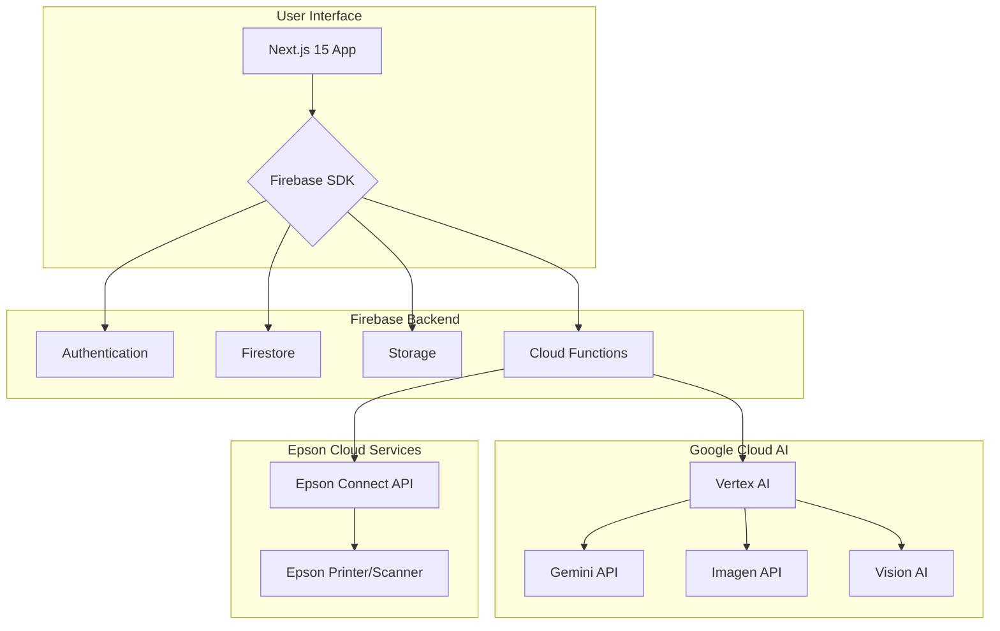

# AIOプレス 超詳細技術仕様書 (Firebase + Google Cloud Edition v2)

## 1. プロジェクト概要

### 1.1. アプリケーションの目的

本アプリケーション「AIOプレス」は、企業のブランド資産を一元管理し、Google Cloudの主要なAI技術（Vertex AI, Gemini, Imagen, Vision AI）とEpsonのクラウドAPIを活用して、「人間」と「AI」の両方に最適化されたブランドコミュニケーションを自動生成する、フルスタックWebアプリケーションである。社内に散在する資産の活用、ブランド構築コストの削減、ブランド一貫性の担保、そしてAI時代における発見可能性の向上を実現することを目的とする。

### 1.2. 解決する課題

| 課題カテゴリ | 具体的な課題 | ビジネスインパクト |
| :--- | :--- | :--- |
| **資産のサイロ化** | 過去に作成された有益な資料（デザイン、コピー、戦略書等）が整理されず、ナレッジとして活用されていない。 | 毎回ゼロから制作するため、デザインコストと工数が膨らみ続ける。 |
| **ブランドの不統一** | 営業、広告、店舗など、部署ごとに異なるメッセージやデザインが乱立し、ブランドの一貫性が欠如している。 | 収益機会が最大23%失われる可能性がある。[1] |
| **AI時代の可視性** | AIによる情報収集やコンテンツ生成が主流となる中で、AIに発見・評価されないブランドは顧客の選択肢から除外される。 | AI・検索経由の商品発見率は70%以上に達しており、この潮流から取り残されるリスクがある。[2] |

## 2. アーキテクチャ

### 2.1. システム構成図

本システムは、Next.jsによるフロントエンド、Firebaseによるバックエンド基盤、Google CloudのAIサービス、そしてEpson Connect APIを連携させた、完全クラウドネイティブな構成を採用する。



### 2.2. 技術スタック

| レイヤー | 技術 | 目的・役割 |
| :--- | :--- | :--- |
| **フロントエンド** | Next.js 15 (App Router), TypeScript, React 19 | 高速かつインタラクティブなUIの構築 |
| | Tailwind CSS, shadcn/ui | モダンで一貫性のあるデザインシステムの実装 |
| | Zustand, React Hook Form, Zod | 状態管理、フォームハンドリング、バリデーション |
| **バックエンド** | Firebase (Authentication, Firestore, Storage) | 認証、データベース、ファイルストレージの提供 |
| | Cloud Functions for Firebase (Node.js 20) | サーバーレスなバックエンドロジック、外部API連携の実行 |
| **AI/ML** | Google Cloud Vertex AI | AIモデルの統合的な管理・実行プラットフォーム |
| | Gemini API, Imagen | テキスト・画像生成、マルチモーダル分析 |
| | Vision AI | 高度な画像認識（OCR、ラベル検出）の提供 |
| **ハードウェア連携** | Epson Connect API | クラウド経由でのプリンター・スキャナー制御 |

## 3. プロジェクトセットアップ

### 3.1. 前提条件

- Node.js >= 20.x
- pnpm (推奨)
- Google Cloud SDK (`gcloud` CLI)
- Firebase CLI
- Google CloudプロジェクトおよびFirebaseプロジェクトが作成済みであること
- Epson Connect Developer Portalでアプリケーション登録済みであること [3]

### 3.2. 初期設定

(変更なし)

### 3.3. 環境変数 (`.env.local`)

```env
# Firebase (Client-side)
NEXT_PUBLIC_FIREBASE_API_KEY="..."
NEXT_PUBLIC_FIREBASE_AUTH_DOMAIN="..."
NEXT_PUBLIC_FIREBASE_PROJECT_ID="..."
NEXT_PUBLIC_FIREBASE_STORAGE_BUCKET="..."
NEXT_PUBLIC_FIREBASE_MESSAGING_SENDER_ID="..."
NEXT_PUBLIC_FIREBASE_APP_ID="..."

# Google Cloud (Server-side / Cloud Functions)
GOOGLE_CLOUD_PROJECT_ID="..."
GOOGLE_APPLICATION_CREDENTIALS="./path/to/service-account.json"

# Epson Connect API (Server-side / Cloud Functions)
EPSON_CONNECT_CLIENT_ID="..."
EPSON_CONNECT_CLIENT_SECRET="..."
```

## 4. ディレクトリ構造

```
src
├── app/                      # Next.js App Router
│   └── ...
├── components/               # Reactコンポーネント
│   └── ...
├── lib/                      # ライブラリ、ヘルパー関数
│   ├── firebase/             # Firebase関連
│   ├── gcp/                  # Google Cloud AI関連
│   ├── epson/                # Epson Connect APIクライアント
│   │   └── client.ts
│   ├── hooks/                # カスタムReactフック
│   └── utils.ts              # 汎用ヘルパー
├── functions/                # Cloud Functions for Firebase
│   ├── src/
│   │   ├── index.ts
│   │   ├── assets.ts         # 資産関連のトリガー関数
│   │   └── epson.ts          # Epson連携のHTTP関数
│   └── ...
└── types/                    # グローバルな型定義
    └── index.ts
```

## 5. Firebase設計

(変更なし)

## 6. Google Cloud AIサービス連携

(変更なし)

## 7. Epsonハードウェア連携 (Epson Connect API)

ユーザーのローカルPCに特別なソフトウェアをインストールすることなく、Epson Connect APIを介してクラウド経由で直接プリンターやスキャナーと連携する。これにより、アーキテクチャが大幅に簡素化され、ユーザー体験が向上する。

### 7.1. 認証フロー (OAuth 2.0)

1.  ユーザーがAIOプレス上で初めてEpson連携機能を利用する際に、Epson Connectの認証ページにリダイレクトする。
2.  ユーザーは自身のEpson Connectアカウントでログインし、AIOプレスへのアクセスを許可（Consent）する。
3.  認証後、Epson ConnectはAIOプレスに認証コードを返す。
4.  AIOプレス（Cloud Function）は、認証コード、クライアントID、クライアントシークレットを使ってアクセストークンとリフレッシュトークンを取得する。
5.  取得したトークンは、Firestoreの `users` コレクションに安全に保存し、以降のAPIリクエストで使用する。

### 7.2. スキャンフロー

1.  **トリガー**: ユーザーがフロントエンドの「スキャンして取り込む」ボタンをクリック。
2.  **API呼び出し**: フロントエンドはCloud Function (`POST /epson/scan`) を呼び出す。
3.  **Epson API連携**: Cloud Functionは、ユーザーのアクセストークンを使い、Epson Connect APIのスキャン機能を呼び出す。
    - **宛先指定**: スキャンデータのアップロード先として、Firebase Storageの署名付きURLを指定する。
4.  **スキャン実行とアップロード**: ユーザーのEpsonスキャナーがスキャンを実行し、取得したデータを直接Firebase Storageの指定されたパスにアップロードする。
5.  **資産化**: Storageへのアップロードが完了すると、6.1で定義した資産分析フロー（Cloud Functionトリガー）が自動的に実行され、スキャンデータがAIOプレス内の「資産」として登録・分析される。

### 7.3. プリントフロー

1.  **トリガー**: ユーザーがAIOプレス上で生成したクリエイティブ（画像など）の「印刷する」ボタンをクリック。
2.  **API呼び出し**: フロントエンドはCloud Function (`POST /epson/print`) を呼び出す。リクエストボディには、印刷したいコンテンツのURL（Firebase Storage上のURL）と、対象のプリンターIDを含める。
3.  **Epson API連携**: Cloud Functionは、ユーザーのアクセストークンを使い、Epson Connect APIのプリント機能を呼び出す。
4.  **印刷実行**: Epson Connect APIは、指定されたプリンターに印刷ジョブを送信し、印刷が実行される。

## 8. デプロイとCI/CD

(変更なし)

---

## 9. 参考文献

[1] Lucidpress. "The Brand Consistency Impact Report".
[2] プレゼンテーション資料「Epsonプレゼン資料(AIO総研).pdf」より。
[3] Epson Connect Developer Portal. https://developer.epsonconnect.com/
