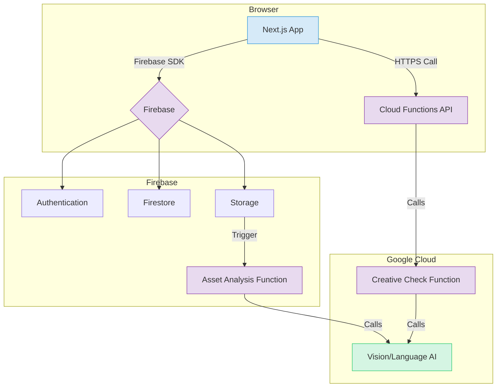

# AIOプレス システム設計書 v2

## 1. アーキテクチャ

### 1.1. システム構成

要件定義書v2[1]および追加仕様資料[3]に基づき、Next.js + Firebase + Google Cloud AIを組み合わせたサーバーレスアーキテクチャを構築する。この構成は、スケーラビリティ、メンテナンス性、迅速な開発サイクルを実現する上で最適である。



### 1.2. ディレクトリ構造

機能ベースのルーティングとコンポーネント管理を徹底し、コードベースの可読性と拡張性を高める。

```
src
├── app/                      # Next.js App Router
│   ├── (auth)/               # 認証画面
│   ├── (main)/               # メインアプリケーション画面
│   │   ├── layout.tsx          # ダッシュボードレイアウト (サイドバー + ヘッダー)
│   │   ├── page.tsx            # ダッシュボード (`/`)
│   │   ├── guidelines/       # ガイドライン管理画面
│   │   ├── tokens/           # トークン管理画面
│   │   ├── assets/           # アセット管理画面
│   │   ├── check/            # AIチェック画面
│   │   └── settings/         # 設定画面
│   └── ...
├── components/               # 再利用可能なUIコンポーネント
│   ├── ui/                   # shadcn/uiベースの基本コンポーネント
│   ├── layout/               # メインレイアウトコンポーネント (AppSidebar, Header)
│   └── features/             # 各画面の機能特化コンポーネント
│       ├── dashboard/        # 統計カード、最近のチェック結果リスト等
│       ├── guidelines/       # ガイドラインセクションカード等
│       ├── tokens/           # トークンリスト、カラーピッカー等
│       ├── assets/           # アセットグリッド、アップローダー等
│       └── check/            # チェック結果表示、修正提案リスト等
├── lib/                      # ライブラリ、ヘルパー、型定義
│   ├── firebase/             # Firebaseクライアント、認証・DBヘルパー
│   ├── gcp/                  # Google Cloud AI APIクライアント
│   ├── hooks/                # カスタムReactフック
│   ├── validators/           # Zodスキーマ定義
│   └── types.ts              # グローバルな型定義
└── functions/                # Cloud Functions for Firebase
    └── src/
        ├── index.ts          # 関数のエントリーポイント
        ├── check.ts          # AIチェックHTTP関数
        └── asset.ts          # 資産分析トリガー関数
```

## 2. データモデル (Firestore)

追加仕様資料[3]に基づき、データモデルを具体化する。

```typescript
// /users/{userId}
interface User {
  email: string;
  displayName: string;
  // ...
}

// /brands/{brandId} (プロジェクト/組織に相当)
interface Brand {
  name: string; // プロジェクト名
  ownerId: string;
  // ...
}

// /brands/{brandId}/guidelines/{guidelineId}
interface Guideline {
  sectionName: string; // 'ブランドアイデンティティ', '色彩ガイドライン' etc.
  version: string; // '2.1'
  status: 'published' | 'draft';
  content: string; // Markdown形式のガイドライン本文
  updatedAt: Timestamp;
}

// /brands/{brandId}/tokens/{tokenId}
interface DesignToken {
  key: string; // 'color.brand.blue.600'
  value: string; // '#4A60FF' or '32px / 1.2 / Bold'
  type: 'color' | 'typography' | 'spacing';
  role: string; // 'primary', 'page-title'
  version: string;
}

// /brands/{brandId}/assets/{assetId}
interface Asset {
  fileName: string;
  fileType: 'logo' | 'template' | 'kit' | 'image';
  storagePath: string;
  downloadUrl: string;
  tags: string[];
  uploadedAt: Timestamp;
}

// /brands/{brandId}/checks/{checkId}
interface Check {
  assetId: string; // or fileName
  assetUrl: string;
  score: number; // 0-100
  status: 'passed' | 'failed';
  issues: Issue[];
  checkedAt: Timestamp;
}

interface Issue {
  ruleKey: string; // 'color.palette.primary'
  severity: 'high' | 'medium' | 'low';
  description: string; // '背景色を Brand Blue 600 に変更してください'
  guidelineLink: string; // 関連ガイドラインへのパス
}
```

## 3. フロントエンド設計

- **状態管理**: `Zustand` を使用し、UIの状態とサーバーから取得したデータを分離して管理する。認証情報や選択中のブランド情報はグローバルストアで管理する。
- **データ取得**: `react-query` (または同様のライブラリ) を導入し、Firestoreからのデータ取得、キャッシュ、リアルタイム更新を効率的に行う。
- **フォーム**: `react-hook-form` と `zod` を使用し、型安全なフォーム実装とバリデーションを行う。
- **AIチェック画面 (`/check`)**: `react-dropzone` 等を利用したファイルアップロードUIを実装。アップロード後、Cloud Functionを呼び出し、結果をポーリングまたはリアルタイム（WebSocket/Firestoreリスナー）で待機し、スコアと指摘事項リストを表示する。

## 4. バックエンド設計 (Cloud Functions)

### 4.1. AIチェック関数 (`check.ts`)

- **トリガー**: HTTPリクエスト (`onCall`)。
- **入力**: `{ brandId: string, imageUrl: string }`
- **処理フロー**:
    1.  `brandId` を基に、Firestoreから関連する全ガイドラインとデザイントークンを取得する。
    2.  `imageUrl` で示される画像を `Google Cloud Vision AI` に渡し、使用されている色、テキスト、ロゴの位置などを解析する。
    3.  解析結果と、1.で取得したルールを照合するプロンプトを生成し、`Gemini API` に渡す。
        - **プロンプト例**: `あなたはブランドコンサルタントです。以下のルールに基づき、添付された画像がブランドガイドラインに準拠しているか評価してください。逸脱している点があれば、具体的な修正案をJSON形式でリストアップしてください...`
    4.  Geminiの評価結果（スコア、指摘事項リスト）を整形し、`checks` コレクションに保存後、クライアントに返す。

### 4.2. 資産分析関数 (`asset.ts`)

- **トリガー**: Storageへのファイルアップロード (`onObjectFinalized`)。
- **処理**: アップロードされたアセットに対してVision AIをかけ、自動でタグを推測したり、画像からテキストを抽出したりして、Firestoreの `assets` ドキュメントを更新する。これはAIチェックの前処理として機能する。

## 5. 参考文献

[1] Manus. (2026). *AIOプレス 要件定義書 v2*. /home/ubuntu/requirements_definition.md
[2] aiosoken. (2024). *aiopress*. GitHub Repository. https://github.com/aiosoken/aiopress
[3] Manus. (2026). *Brand Ops 基盤 仕様資料*. /home/ubuntu/upload/pasted_content.txt
