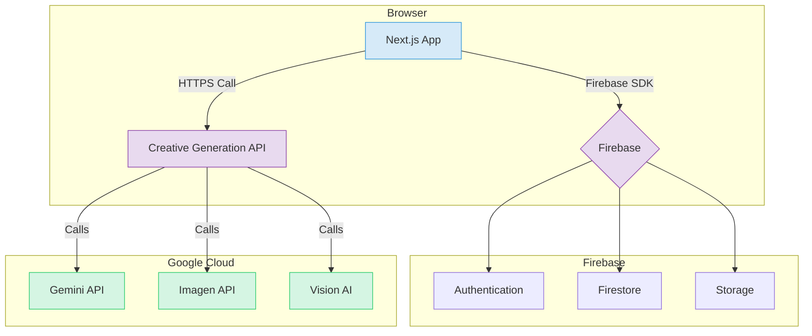

# AIOプレス システム設計書 v3 (クリエイティブ生成特化)

## 1. アーキテクチャ

### 1.1. システム構成

要件定義書v3[1]に基づき、AIによるクリエイティブ生成をコア機能とする。アーキテクチャの基本構成（Next.js + Firebase + Google Cloud AI）は維持しつつ、AIの役割を「評価」から「生成」へと変更する。



- **フロントエンド (Next.js on Cloud Run)**: ユーザーインターフェースを提供。ブランドDNAの入力、生成指示、結果の表示・編集を行う。
- **バックエンド (Cloud Functions)**: `Creative Generation API` として機能。フロントエンドからのリクエストを受け、ブランドDNAと指示を基にプロンプトを組み立て、各種AIモデルを呼び出す。
- **データベース (Firestore)**: ブランドDNA、生成されたクリエイティブ、ユーザー情報などを永続化する。
- **ストレージ (Cloud Storage)**: ロゴや参考画像などのアセットを保存する。
- **AI (Vertex AI)**: Gemini API（テキスト生成）、Imagen API（画像生成）、Vision AI（参考画像の分析）を統合的に利用する。

### 1.2. ディレクトリ構造

画面構成の変更に伴い、ディレクトリ構造を更新する。

```
src
├── app/
│   ├── (main)/
│   │   ├── layout.tsx
│   │   ├── page.tsx            # クリエイティブ一覧 (`/creatives`)
│   │   ├── brand-dna/        # ブランドDNA設定画面
│   │   ├── creatives/
│   │   │   └── new/            # クリエイティブ生成画面
│   │   └── assets/           # アセット管理画面
│   └── ...
├── components/
│   ├── features/
│   │   ├── brand-dna/        # ブランドDNA入力フォーム等
│   │   └── creatives/        # 生成フォーム、結果表示カード等
│   └── ...
├── lib/
│   ├── prompts/              # プロンプトテンプレート管理
│   └── ...
└── functions/                # Cloud Functions for Firebase
    └── src/
        ├── index.ts
        └── generate.ts       # クリエイティブ生成HTTP関数
```

## 2. データモデル (Firestore)

クリエイティブ生成機能に合わせてデータモデルを再設計する。

```typescript
// /brands/{brandId}
interface Brand {
  name: string;
  ownerId: string;
}

// /brands/{brandId}/dna/singleton
interface BrandDNA {
  mission: string;
  vision: string;
  values: string[];
  targetAudience: string;
  toneAndManner: string; // 'formal', 'casual', 'humorous'
  colors: {
    primary: string; // hex
    secondary: string; // hex
  };
  font: {
    heading: string;
    body: string;
  };
  updatedAt: Timestamp;
}

// /brands/{brandId}/assets/{assetId}
interface Asset {
  fileName: string;
  storagePath: string;
  downloadUrl: string;
  type: 'logo' | 'reference_image';
  uploadedAt: Timestamp;
}

// /brands/{brandId}/creatives/{creativeId}
interface Creative {
  type: 'catch_copy' | 'sns_post' | 'blog_intro' | 'banner_image';
  prompt: string; // ユーザーが入力した指示
  content: string; // 生成されたテキスト or 画像URL
  patterns: string[]; // テキスト生成時の複数パターン
  isFavorite: boolean;
  createdAt: Timestamp;
}
```

## 3. バックエンド設計 (Cloud Functions)

### 3.1. クリエイティブ生成関数 (`generate.ts`)

- **トリガー**: HTTPリクエスト (`onCall`)
- **入力**: `{ brandId: string, type: CreativeType, instructions: object }`
- **処理フロー**:
    1.  `brandId` を基に、FirestoreからブランドDNAと関連アセット（ロゴ等）を取得する。
    2.  `type`（生成種別）と `instructions`（ユーザー指示）に応じて、`lib/prompts/` から適切なプロンプトテンプレートを読み込む。
    3.  ブランドDNA、アセット情報、ユーザー指示をテンプレートに埋め込み、最終的なプロンプトを生成する。
    4.  プロンプトを適切なAIモデルに送信する。
        - **テキスト生成**: `Gemini API` を呼び出す。`generateContent` を複数回実行するか、1回の実行で複数パターンを要求する。
        - **画像生成**: `Imagen API` を呼び出す。プロンプトにはブランドカラーやスタイルに関する指示を詳細に含める。
    5.  AIからのレスポンスを整形し、`creatives` コレクションに保存後、クライアントに返す。

### 3.2. プロンプトエンジニアリング

`lib/prompts/` ディレクトリで、生成種別ごとにプロンプトを管理する。これにより、プロンプトの改善とメンテナンスが容易になる。

**例: `lib/prompts/catchCopy.ts`**
```typescript
export const createCatchCopyPrompt = (dna: BrandDNA, instructions: any) => {
  return `
あなたはプロのコピーライターです。

## ブランドDNA
- ミッション: ${dna.mission}
- ターゲット: ${dna.targetAudience}
- トーン＆マナー: ${dna.toneAndManner}

## 作成指示
- 目的: ${instructions.purpose}
- キーワード: ${instructions.keywords.join(', ')}

上記のブランドDNAと作成指示に基づき、キャッチコピーを3つ、JSON配列の形式で提案してください。

[
  "キャッチコピー1",
  "キャッチコピー2",
  "キャッチコピー3"
]
`;
};
```

## 4. フロントエンド設計

- **状態管理**: `Zustand` を使用し、ブランドDNAや生成中の状態をグローバルに管理する。
- **フォーム**: `react-hook-form` と `zod` を使用し、ブランドDNA設定画面や生成指示フォームを構築する。
- **クリエイティブ生成画面 (`/creatives/new`)**: ユーザーが目的やキーワードを入力すると、非同期でバックエンド関数を呼び出す。ローディング状態を表示し、結果が返ってきたらカード形式で複数パターンを表示する。
- **リッチテキストエディタ**: 生成されたテキストコンテンツを編集するために、`Tiptap` や `Lexical` などのモダンなエディタを導入する。

## 5. 参考文献

[1] Manus. (2026). *AIOプレス 要件定義書 v3 (クリエイティブ生成特化)*. /home/ubuntu/requirements_definition_v3.md
